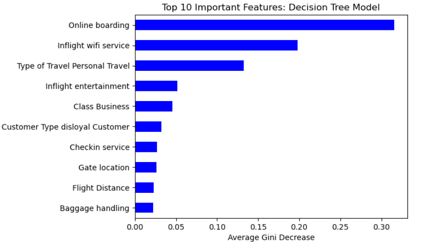
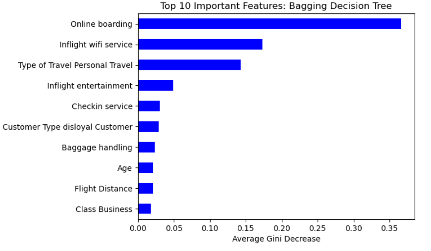
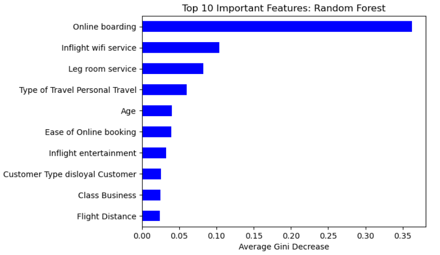
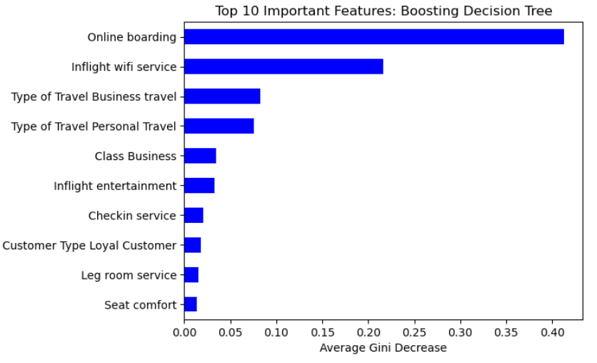
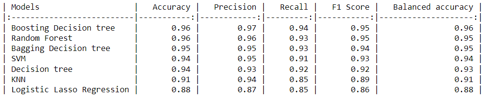
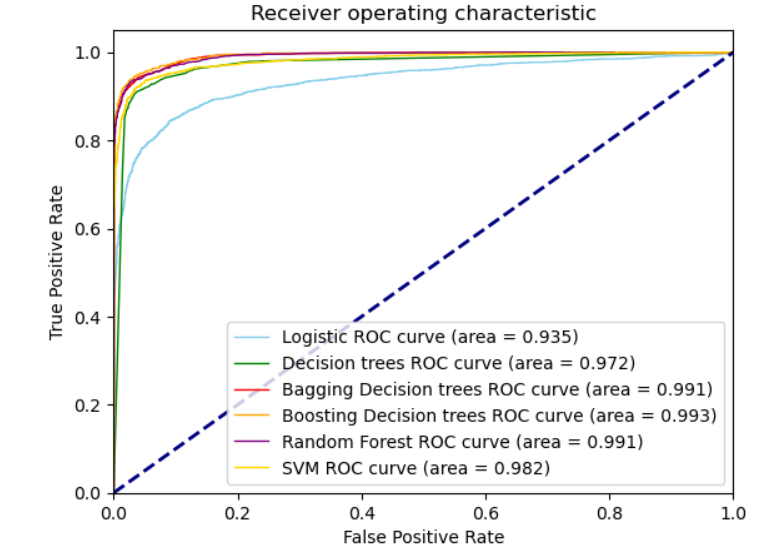

# Airline Passenger Satisfaction Classification  

This dataset contains an airline passenger satisfaction survey. In this project, we explored what are the important predictors related to passenger satisfaction using different types of Decision Tree models (Bagging, Random Forest, Boosting) and Logistic Lasso regression. Secondly, we predicted passenger satisfaction by comparing the the accuracy, precision, recall, F1 score of the following models KNN, Decision Tree, Bagging Decision tree, Boosting Decision tree, Random Forest, Support Machine Vector (SVM), and Logistic Lasso regression.

## Important predictors relating to passenger satisfaction

Four Decision tree models and Logistic Lasso regression were used to determined important predictors related to passenger satisfaction. The 5 models were fitted using the entire dataset (103,904 observations). There were also used for prediction of accuracy in classifying whether or not a passenger is satisfied using the testing dataset.

For the trees models, the Gini index was used to determined important predictors. KNN model was used for imputation of NA values.

The plots below show the top 10 important features for each of the decision tree models. Clearly, having a great `Online boarding` service and `Inflight wifi service` are important for passenger satisfaction since the two variables are in the top 3 in all four plots of important variables.   

A Logistic Lasso regression was also performed. The table below is the estimated coefficient for the parameters of the model. The table contains the estimated Log-Odds and Odds Ratio for each variable and order by Odds Ratio coefficient.

There is 1 variable `Class Eco` with estimated parameter of zero. This is because Lasso regression was performed. 

Similarly with the Decision tree models, the Logistic Lasso regression shows that `Online Boarding` and `Inflight wifi service` has association with passenger satisfaction with an Odds Ratio 2.3 and 1.7 respectively.

Meaning, as `Online boarding` service satisfaction increase by one, the odds of passenger satisfaction increase by a factor of 2.3 when all other variables are held fixed. 

Also, as `Inflight wifi service`  satisfaction increase by one, the odds of passenger satisfaction increase by a factor of 1.7 when all other variables are held fixed.

Conclusion: In all four Decision tree models and the Logistic Lasso regression model the top variables that are associated with passenger satisfaction are `Online boarding` and `Inflight wifi service`. 

# Predicting Passanger Satisfaction 

**Note: For predicting the passenger satisfaction, a random sample of 20,000 was selected from the dataset**

The following models were used, KNN, Logistic, SVM, Decision Tree, Bagging Decision tree, Random Forest, and Boosting Decision tree to determine passenger satisfaction. To estimated the most accurate model 10-fold cross validation was performed with an 70/30 split for training & testing.

The no information rate for the testing dataset is about 0.57 and prevalence is 0.43 (2253/6000).

The figure below shows each of the model performance metrics. All 7 models performed well in predicting passenger satisfaction since the accuracy for all models is greater than the no information rate of 0.57. The Logistic lasso regression has the lowest metrics with an F1 score of 0.86. The top three models are Boosting, Bagging, and Random Forest have really close performances metrics. The Boosting model has the greatest precision of 0.97 and balanced accuracy of 0.96.

The plot below show receiver operating characteristic curve (ROC) for each model. All model area under curve (AUC) is grater than 0.9 meaning the all models performed well in classifying satisfaction.  Again the Boosting Decision Tree model has the highest AUC of 0.993.

Conclusion: After training the models using 10-fold cross validation, all models performed well in predicting passenger with model. Overall the Boosting Decision tree model is the best classifier with the highest performance metrics. 

## Dataset Airline passanger satisfaction

The airline passenger satisfaction survey dataset can be found [here](https://www.kaggle.com/datasets/teejmahal20/airline-passenger-satisfaction). There are 103,904 observations and 22 predictors. There is only one variable `Arrival_Delay_in_Minutes` that contains about 0.3% NA values. Applied KNN imputation method to replace missing values.

The following are the description of the variables.

* Gender: Gender of the passengers (Female, Male)

* Customer Type: The customer type (Loyal customer, disloyal customer)

* Age: The actual age of the passengers

* Type of Travel: Purpose of the flight of the passengers (Personal Travel, Business Travel)

* Class: Travel class in the plane of the passengers (Business, Eco, Eco Plus)

* Flight distance: The flight distance of this journey

* Inflight wifi service: Satisfaction level of the inflight wifi service (0:Not Applicable;1-5)

* Departure/Arrival time convenient: Satisfaction level of Departure/Arrival time convenient

* Ease of Online booking: Satisfaction level of online booking

* Gate location: Satisfaction level of Gate location

* Food and drink: Satisfaction level of Food and drink

* Online boarding: Satisfaction level of online boarding

* Seat comfort: Satisfaction level of Seat comfort

* Inflight entertainment: Satisfaction level of inflight entertainment

* On-board service: Satisfaction level of On-board service

* Leg room service: Satisfaction level of Leg room service

* Baggage handling: Satisfaction level of baggage handling

* Check-in service: Satisfaction level of Check-in service

* Inflight service: Satisfaction level of inflight service

* Cleanliness: Satisfaction level of Cleanliness

* Departure Delay in Minutes: Minutes delayed when departure

* Arrival Delay in Minutes: Minutes delayed when Arrival

* Satisfaction: Airline satisfaction level(Satisfaction, neutral/dissatisfaction)

